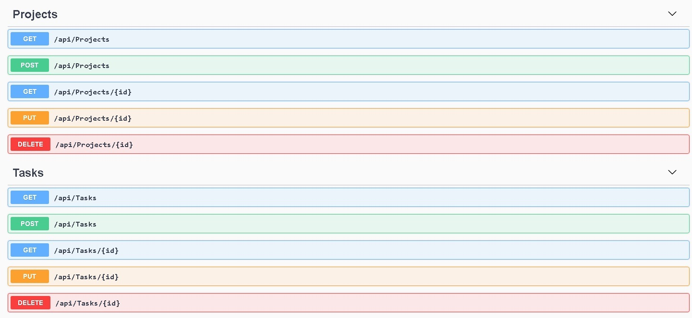

# Projects

This projet is using dotnet version 2.1.700

this project was created with the following command:

```
dotnet new webapi
```

This project is using UseInMemory Database, Entity Framework Core and Dependency injection.

This project is using washbuckle.AspNetCore version 4.0.1 compatible with Microsoft.AspNetCore.Mvc.Core (>= 2.0.0).

## Prerequisites 🚀

1. Install Windows 10 or Linux
2. Install dotnet version 2.1.700
3. Optional docker.

## Installation 🔨

1. Install windows or linux.
2. Download the dotnet from: https://dotnet.microsoft.com/download/dotnet-core/2.1

## Configuration 🔧

1. Run app with the following command:

```
dotnet run
```

2. start the app on:

```
http://localhost:5000/
https://localhost:5001/
```
 
## Diagrams 💎

## End Points 🔍

After run app you can see documentation in https://localhost:5001/swagger/index.html

<p align="center">
  
</p>

### Projects

```
GET PROJECTS
{Host}:{Port}/api/v1/projects
{Host}:{Port}/api/v1/projects/{project_id}
https://localhost:5001/api/projects
https://localhost:5001/api/projects/c903a85d

POST PROJECTS
{Host}:{Port}/api/v1/projects
https://localhost:5001/api/projects
BODY:
[
    {
        "name": "Proyecto Seguridad",
        "description": "Proyecto de Seguridad",
        "state": "Inactivo",
        "createdDate": "27-05-2019"
    }
]

PUT PROJECTS
{Host}:{Port}/api/v1/projects/{project_id}
localhost:8080/api/v1/projects/c903a85d
BODY:
{
   "name": "Proyecto Seguridad",
   "description": "Proyecto de Seguridad",
   "state": "Inactivo",
   "createdDate": "27-05-2019"
}

DELETE PROJECTS
{Host}:{Port}/api/v1/projects/{project_id}
https://localhost:5001/api/projects/c903a85d
```

### Tasks

```
GET TASKS
{Host}:{Port}/api/v1/tasks
{Host}:{Port}/api/v1/tasks/{task_id}
https://localhost:5001/api/tasks
https://localhost:5001/api/tasks/86dba5c3

POST TASKS
{Host}:{Port}/api/v1/tasks
https://localhost:5001/api/tasks
BODY:
{
  "name": "Escribir Documentacion",
  "description": "Escribir Documentacion",
  "state": "In-Progress",
  "owner": "Goku",
  "createdDate": "27-05-2019"
}

PUT TASKS
{Host}:{Port}/api/v1/tasks/{task_id}
https://localhost:5001/api/projects/c903a85d
BODY:
{
  "name": "Escribir Documentacion",
  "description": "Escribir Documentacion",
  "state": "In-Progress",
  "owner": "Vegeta",
  "createdDate": "27-05-2019"
}

DELETE TASKS
{Host}:{Port}/api/v1/tasks/{task_id}
https://localhost:5001/api/projects/c903a85d
```
## Postman 🔦

Configuration
<p align="center">
  
</p>

Get Request
<p align="center">
  
</p>

## Contributing 💡

1. Fork it!
2. Create your feature branch: `git checkout -b issue/1001`
3. Commit your changes: `git commit -m 'issue/1001: Add some feature'`
4. Push to the branch: `git push origin issue/1001`
5. Submit a pull request.

## MIT License 📃
Copyright <2020> <COPYRIGHT Richard Severich>

Permission is hereby granted, free of charge, to any person obtaining a copy of this software and associated documentation files (the "Software"), 
to deal in the Software without restriction, including without limitation the rights to use, copy, modify, merge, publish, distribute, sublicense, 
and/or sell copies of the Software, and to permit persons to whom the Software is furnished to do so, subject to the following conditions:
The above copyright notice and this permission notice shall be included in all copies or substantial portions of the Software.

THE SOFTWARE IS PROVIDED "AS IS", WITHOUT WARRANTY OF ANY KIND, EXPRESS OR IMPLIED, INCLUDING BUT NOT LIMITED TO THE WARRANTIES OF MERCHANTABILITY, 
FITNESS FOR A PARTICULAR PURPOSE AND NONINFRINGEMENT. IN NO EVENT SHALL THE AUTHORS OR COPYRIGHT HOLDERS BE LIABLE FOR ANY CLAIM, DAMAGES OR OTHER LIABILITY, 
WHETHER IN AN ACTION OF CONTRACT, TORT OR OTHERWISE, ARISING FROM, OUT OF OR IN CONNECTION WITH THE SOFTWARE OR THE USE OR OTHER DEALINGS IN THE SOFTWARE.
